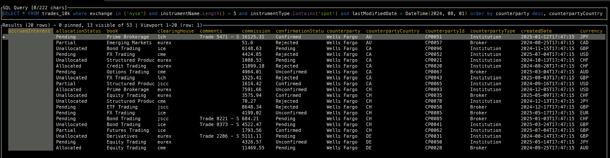

# SQL CLI - Advanced CSV/JSON Viewer with SQL Support

A powerful command-line tool for exploring CSV and JSON files using SQL queries, with intelligent tab completion and a sophisticated TUI. Works standalone (like csvlens) or can connect to REST API data sources.

trades demo


## customers demo


## Primary Use Cases

### 📊 Standalone CSV/JSON Viewer (Most Common)
```bash
# Just point at any CSV or JSON file - no setup required!
sql-cli data.csv
sql-cli sales.json


# Instantly query with SQL, filter, sort, aggregate, export
SELECT * FROM data WHERE amount > 1000 ORDER BY date DESC
```


## Screenshots

```sql
SELECT * FROM trades_10k where exchange in ('nyse') and instrumentName.Length() > 5 and instrumentType.Contains('spot') and lastModifiedDate > DateTime(2024, 08, 01) order by counterparty desc, counterpartyCountry limit 20"
```




### 🔌 REST API Data Source (Advanced)
```bash
# Optionally connect to a proxy server for remote data
sql-cli --api-url http://api.example.com
```

## Features

### ✨ Smart SQL Completion
- **Context-aware tab completion** - understands SQL syntax, not just naive string matching
- **Cursor position tracking** - provides completions even mid-query (e.g., deleting `*` in `SELECT * FROM trade_deal` and typing `plat<tab>`)
- **Column-aware suggestions** - knows about your 190+ columns and suggests relevant ones

### 🎯 Dynamic LINQ Query Support
- **String methods**: `platformOrderId.Contains("E")`, `ticker.StartsWith("AA")`, `ticker.IndexOf("abc") > 10`
- **Complex expressions**: `Price > 100 AND Ticker == "AAPL"`
- **Property name normalization** - automatically converts `platformOrderId` → `PlatformOrderId`
- **Rich filtering** - supports all .NET string methods and comparison operators

### 🖥️ Professional TUI Interface  
- **Split-view design** - command input at top, results grid below
- **Scrollable data grid** - handles large result sets efficiently
- **Dynamic column sizing** - automatically adjusts column widths based on visible data
- **Compact mode** - toggle with 'C' to fit more columns on screen
- **Rainbow parentheses** - visual matching for nested SQL queries
- **Multi-source indicators** - shows data source (📦 Cache, 📁 File, 🌐 API, 🗄️ SQL)
- **Status bar** - shows query status, mode indicators, and navigation hints
- **Mode switching** - Command mode for input, Results mode for navigation

### ⚡ High Performance
- **Rust-based client** - fast startup and efficient memory usage
- **Streaming results** - handles large datasets without blocking
- **Cross-platform** - works on Linux and Windows terminals

## Architecture

```
┌─────────────────┐    HTTP/JSON    ┌──────────────────┐
│   Rust CLI      │◄──────────────►│   C# REST API    │
│                 │                 │                  │
│ • ratatui TUI   │                 │ • ASP.NET Core   │
│ • reedline      │                 │ • Dynamic LINQ   │
│ • SQL parser    │                 │ • Query processor│
│ • Completions   │                 │ • 190+ columns  │
└─────────────────┘                 └──────────────────┘
```

## Keyboard Shortcuts

### Navigation
- **↑/↓, j/k** - Navigate rows
- **←/→, h/l** - Navigate columns  
- **Page Up/Down** - Page through results
- **g/G** - Go to first/last row
- **0/$** - Go to first/last column
- **Tab** - Autocomplete in command mode

### Features
- **Enter** - Execute query
- **F1** - Show help
- **F3** - Toggle single/multi-line editor
- **C** - Toggle compact mode (more columns visible)
- **N** - Toggle row numbers (vim-style :set nu)
- **:** - Jump to row number (e.g., :200 jumps to row 200)
- **Space** - Toggle viewport lock (anchor scrolling)
- **/** - Search in results
- **n/N** - Next/previous search match
- **s** - Sort by current column
- **f** - Filter results
- **Ctrl+R** - Command history search
- **Ctrl+C** - Copy current row/cell
- **ESC** - Return to command mode
- **q** - Quit application

### Advanced SQL Features
- **String.IsNullOrEmpty()** - Check for null or empty strings
- **String.Contains()** - Substring search
- **String.StartsWith()** - Prefix matching
- **String.EndsWith()** - Suffix matching
- **Rainbow parentheses** - Automatic color coding for nested queries

## File Support

### CSV/JSON Loading
Load CSV or JSON files directly with automatic schema detection:
```bash
# Load CSV file - automatically executes SELECT * and shows data
sql-cli data/customers.csv

# Load JSON file  
sql-cli data/users.json
```

Features when loading files:
- **Auto-execution** - Immediately shows data without typing a query
- **Pre-filled query** - Input shows `SELECT * FROM table_name` for easy editing
- **Schema detection** - Automatically detects columns and types
- **Virtual viewport** - Efficiently handles large files

## Feature Demos

<details>
<summary>📺 View detailed feature demonstrations</summary>

### Column Search & Statistics
Press `/` to search for a specific column (e.g., `CounterpartyCountry`), then press `Enter` to focus. 
Press `Shift+S` to view frequency statistics for the filtered dataset.


### More Features (Coming Soon)
- [Fuzzy Search & Filtering](sql-cli/demos/fuzzy-filter.gif)
- [Column Navigation](sql-cli/demos/column-navigation.gif)  
- [Column Statistics](sql-cli/demos/statistics.gif)
- [SQL Queries & Autocomplete](sql-cli/demos/sql-queries.gif)
- [Vim-style Navigation](sql-cli/demos/vim-navigation.gif)

</details>

## Installation

### Download Pre-built Binaries

Download the latest release from the [Releases](https://github.com/YOUR_USERNAME/sql-cli/releases) page:

- **Linux x64**: `sql-cli-linux-x64.tar.gz`
- **Windows x64**: `sql-cli-windows-x64.zip`
- **macOS x64 (Intel)**: `sql-cli-macos-x64.tar.gz`
- **macOS ARM64 (Apple Silicon)**: `sql-cli-macos-arm64.tar.gz`

Extract and run:
```bash
# Linux/macOS
tar xzf sql-cli-*.tar.gz
chmod +x sql-cli
./sql-cli

# Windows
# Extract the zip file and run sql-cli.exe
# If Windows Defender blocks it (false positive), either:
# 1. Click "More info" → "Run anyway" in the SmartScreen dialog
# 2. Or run: PowerShell -ExecutionPolicy Bypass .\scripts\unblock-windows.ps1
```

**Note for Windows users**: The binary is not code-signed, which may trigger false positives in Windows Defender. This is common for open-source Rust applications. The tool is completely safe - you can review the source code and build it yourself if preferred.

### Build from Source

```bash
git clone https://github.com/YOUR_USERNAME/sql-cli.git
cd sql-cli/sql-cli
cargo build --release
./target/release/sql-cli
```

## Quick Start

### Standalone Mode (CSV/JSON Files)
```bash
# Query a CSV file
sql-cli data/customers.csv

# Query a JSON file  
sql-cli data/trades.json
```

### API Server Mode
```bash
cd TradeApi
dotnet run
# Server starts on http://localhost:5073

# In another terminal
sql-cli --api http://localhost:5073
```

### Running the CLI
```bash
cd sql-cli
cargo run
# TUI interface launches
```

### Example Queries
```sql
SELECT * FROM trade_deal WHERE platformOrderId.Contains("200000")
SELECT DealId, Ticker, Price FROM trade_deal WHERE Price > 100 AND Ticker.StartsWith("AA")
SELECT * FROM trade_deal WHERE Ticker IN ("AAPL", "MSFT") ORDER BY Price DESC
```

## Development

### Testing
```bash
# Run C# API tests
cd TradeApi.Tests
dotnet test

# Run Rust CLI tests  
cd sql-cli
cargo test
```

### Key Components

#### Rust CLI (`sql-cli/src/`)
- `main.rs` - Entry point and TUI initialization
- `tui_app.rs` - Main TUI application with split-view interface
- `parser.rs` - SQL syntax parser for context awareness
- `cursor_aware_parser.rs` - Advanced completion with cursor tracking
- `api_client.rs` - HTTP client for REST API communication
- `completer.rs` - Tab completion logic

#### C# API (`TradeApi/`)
- `Controllers/TradeController.cs` - REST endpoints for queries and schema
- `Services/QueryProcessor.cs` - Dynamic LINQ query processing and property normalization
- `Services/TradeDataService.cs` - Mock data service with 190+ columns
- `Models/TradeDeal.cs` - Trade entity with comprehensive field set

## Recent Enhancements 🎉

- ✅ **Vim-style row numbers** - Press 'N' to toggle row numbers display
- ✅ **Jump to row** - Press ':' then row number to jump directly (e.g., :200)
- ✅ **Viewport position preservation** - Maintains position when toggling between modes
- ✅ **Dynamic viewport column sizing** - Columns resize based on visible data
- ✅ **Compact mode** - Press 'C' to fit more columns (reduced padding)
- ✅ **Viewport lock** - Press Space to anchor scrolling position
- ✅ **Auto-execute on file load** - CSV/JSON files show data immediately
- ✅ **Rainbow parentheses** - Visual matching for nested queries
- ✅ **Multi-source data proxy** - Query SQL Server, APIs, and files seamlessly
- ✅ **Visual source indicators** - See where your data comes from
- ✅ **String.IsNullOrEmpty()** - LINQ-style null/empty checking
- ✅ **Named cache system** - Save and reload query results
- ✅ **Schema-aware history** - Smart command suggestions
- ✅ **Cross-platform CI/CD** - Automated builds for Linux, Windows, macOS

## Roadmap

- ✅ csvlens-style table features (column sorting, filtering) - **DONE!**
- ✅ Vim-like search and navigation - **DONE!** 
- ✅ Query history and persistence - **DONE!**
- [ ] Grammar tree visualization
- [ ] Separate diagnostic console
- [ ] Multiple database connection support
- [ ] Export to various formats (CSV, JSON, Excel)
- [ ] Query performance profiling

## License

Private repository - All rights reserved.