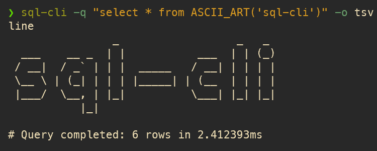
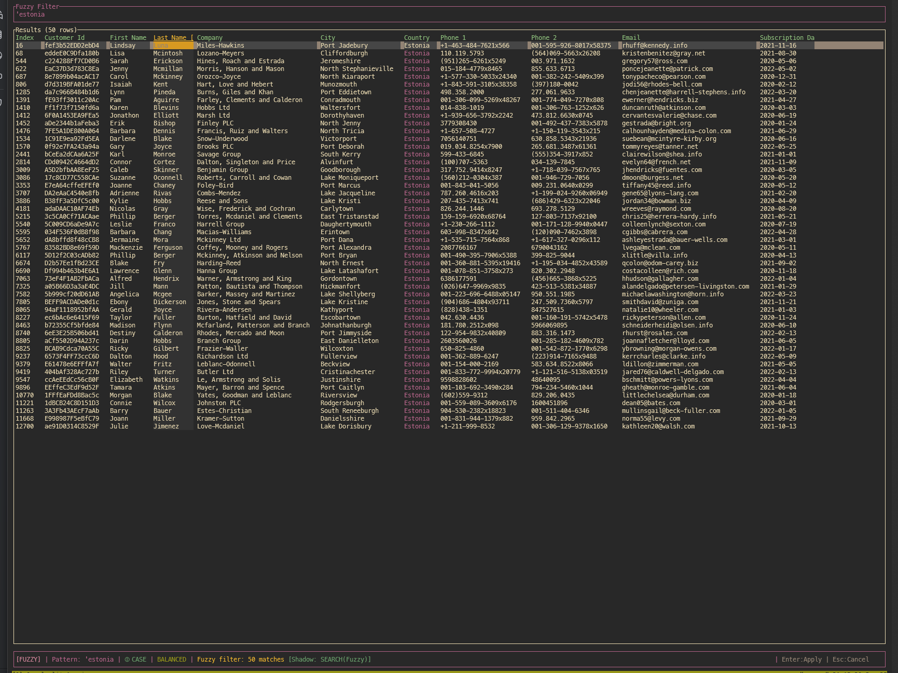
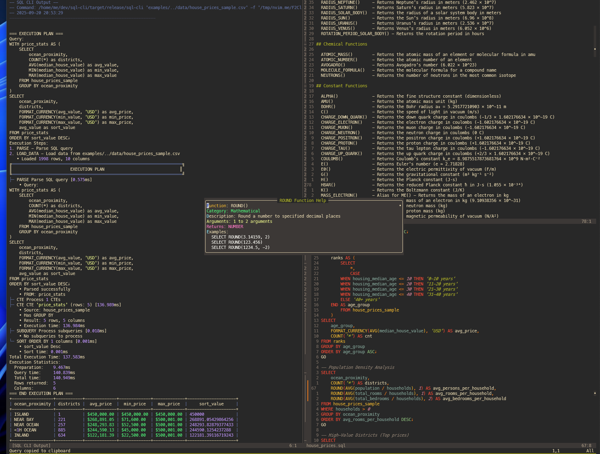
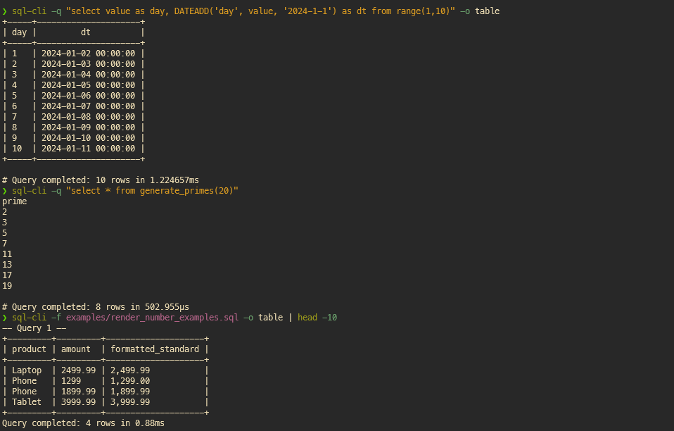
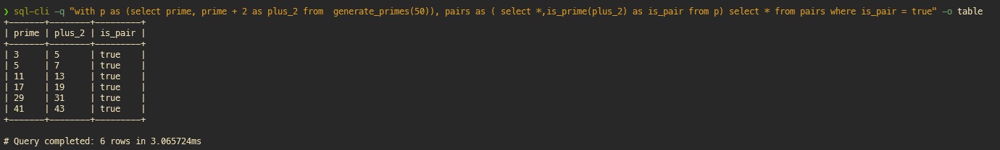
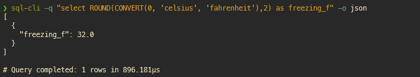

# SQL CLI - Powerful CSV/JSON Query Tool with Interactive TUI & CLI Modes

**A vim-inspired SQL query tool for CSV and JSON files. Features both an interactive terminal UI for data exploration and a non-interactive CLI mode for scripting and automation.**


## 🚀 Why SQL CLI?

**Think `less` for CSV files, but with SQL superpowers:**
- **🎯 Two Modes**: Interactive TUI for exploration, non-interactive for scripting & automation
- **📁 Point & Query**: Drop any CSV/JSON file and immediately start querying  
- **⚡ Lightning Fast**: In-memory engine - 8ms SELECT on 100K rows ([benchmarks](PERFORMANCE.md))
- **🎮 Vim-Inspired**: Modal editing, `hjkl` navigation, powerful keyboard shortcuts
- **🧠 Smart Completion**: Context-aware SQL completion with fuzzy matching
- **🔍 Advanced Filtering**: Regex, fuzzy search, complex WHERE clauses
- **📊 Rich SQL Features**: Date functions, string manipulation, mathematical operations
- **📤 Multiple Outputs**: CSV, JSON, TSV, or pretty tables - perfect for pipelines


## ⚡ Quick Start

```bash
# Install from Cargo  
cargo install sql-cli

# Point at any CSV or JSON file
sql-cli data.csv

# Immediately start querying with full SQL support
SELECT * FROM data WHERE amount > 1000 ORDER BY date DESC LIMIT 10
```

## 🎯 Three Powerful Modes

### 🖥️ **Interactive TUI Mode** (Default)
Launch the full vim-inspired terminal interface for data exploration:


```bash
# Interactive mode - explore your data with vim keybindings
sql-cli data.csv
sql-cli trades.json

# Navigate with hjkl, search with /, execute queries interactively
```

### 📝 **Neovim Plugin Mode** (Advanced)
A sophisticated Neovim plugin provides an IDE-like experience for SQL development:



```vim
" Execute queries directly from Neovim with intelligent features:
" - Visual selection execution
" - Function documentation (K for help)
" - Query navigation (]q, [q)
" - Live results in split panes
" - CSV/JSON export capabilities
" - Intelligent autocompletion (columns, functions, keywords)
" - Schema inspection with type inference
" - NEW: SQL Refactoring & Code Generation Tools
```

**🆕 New Refactoring Features:**
- **Smart CASE Generation** - Generate CASE statements from actual data values or ranges
- **Column Explorer** - Preview distinct values before writing queries (`\sD`)
- **Auto-detect Data** - Intelligently finds data files from context
- **Range Banding** - Create equal-width bands for numeric data
- **Window Functions** - Interactive wizard for complex analytics

See [nvim-plugin/README.md](nvim-plugin/README.md) for installation and full feature list.

### 🚀 **Non-Interactive Query Mode**
Execute SQL queries directly from the command line - perfect for scripting and automation:







```bash
# Run a query and get CSV output
sql-cli data.csv -q "SELECT * FROM data WHERE price > 100"

# Output as JSON
sql-cli data.csv -q "SELECT id, name, value FROM data" -o json

# Pretty table format
sql-cli data.csv -q "SELECT * FROM data LIMIT 10" -o table

# Save results to file
sql-cli data.csv -q "SELECT * FROM data WHERE status='active'" -O results.csv

# Execute SQL from a file
sql-cli large_dataset.json -f complex_analysis.sql -o table

# Limit output rows
sql-cli data.csv -q "SELECT * FROM data" -o json -l 100
```

#### **Non-Interactive Options:**
- `-q, --query <SQL>` - Execute SQL query directly
- `-f, --query-file <file>` - Execute SQL from file
- `-o, --output <format>` - Output format: `csv`, `json`, `table`, `tsv` (default: csv)
- `-O, --output-file <file>` - Write results to file
- `-l, --limit <n>` - Limit output to n rows
- `--case-insensitive` - Case-insensitive string matching
- `--auto-hide-empty` - Auto-hide empty columns

#### **Use Cases:**
```bash
# Data pipeline integration
sql-cli raw_data.csv -q "SELECT * FROM raw_data WHERE valid=1" | process_further.sh

# Automated reporting
sql-cli sales.csv -f monthly_report.sql -o json > report_$(date +%Y%m).json

# Quick data analysis
sql-cli logs.csv -q "SELECT COUNT(*) as errors FROM logs WHERE level='ERROR'" -o table

# Data cleaning
sql-cli messy_data.csv -q "SELECT * FROM messy_data WHERE email.EndsWith('.com')" -O clean_data.csv

# Complex calculations
sql-cli finances.csv -q "SELECT date, amount * (1 + tax_rate) as total FROM finances" -o table
```

## 💪 Powerful SQL Engine Features

### 🔥 **Core SQL + Modern Extensions**
Your SQL CLI combines traditional SQL with modern LINQ-style methods and advanced functions:

```sql
-- Traditional SQL with modern LINQ methods
SELECT 
    customer_name.Trim() as name,
    email.EndsWith('.com') as valid_email,
    ROUND(price * quantity, 2) as total,
    DATEDIFF('day', order_date, NOW()) as days_ago
FROM orders 
WHERE customer_name.Contains('corp')
  AND price BETWEEN 100 AND 1000
  AND order_date > DATEADD('month', -6, TODAY())
ORDER BY total DESC 
LIMIT 25
```

### 📊 **Advanced Functions Library**

#### **Date & Time Functions**
```sql
-- Comprehensive date handling with multiple format support
SELECT 
    NOW() as current_time,                    -- 2024-08-31 15:30:45
    TODAY() as current_date,                  -- 2024-08-31  
    DATEDIFF('day', '2024-01-01', order_date) as days_since_year,
    DATEADD('month', 3, ship_date) as warranty_expires
FROM orders
WHERE DATEDIFF('year', created_date, NOW()) <= 2
```

**Supported Date Formats:**
- ISO: `2024-01-15`, `2024-01-15 14:30:00`
- US: `01/15/2024`, `01/15/2024 2:30 PM` 
- EU: `15/01/2024`, `15/01/2024 14:30`
- Excel: `15-Jan-2024`, `Jan 15, 2024`
- Full: `January 15, 2024`, `15 January 2024`

#### **Mathematical Functions**  
```sql
-- Rich mathematical operations
SELECT 
    ROUND(price * 1.08, 2) as taxed_price,
    SQRT(POWER(width, 2) + POWER(height, 2)) as diagonal,
    MOD(id, 100) as batch_number,
    ABS(actual - target) as variance,
    POWER(growth_rate, years) as compound_growth
FROM products
WHERE SQRT(area) BETWEEN 10 AND 50
```

**Available Math Functions:**
- **Basic:** `ROUND`, `ABS`, `FLOOR`, `CEILING`, `MOD`, `QUOTIENT`, `POWER`, `SQRT`, `EXP`, `LN`, `LOG`, `LOG10`
- **Prime Numbers:** `PRIME(n)` - nth prime, `IS_PRIME(n)` - primality test, `PRIME_COUNT(n)` - count primes ≤ n, `NEXT_PRIME(n)`, `PREV_PRIME(n)`
- **Constants:** `PI()`, `E()` - mathematical constants


```
sql-cli -q "select sum_n(value) as triangle from range(1,10)"
```

```sql
-- use distinct to only select unique values
sql-cli -q "select distinct value % 4 from range(1,50)"
```

```sql
-- can use a range cte to select primes
sql-cli -q "WITH primes as (select is_prime(value) as is_p, value as n from range(2,100)) select n from primes where is_p = true "
```

```sql
-- sql-cli data/numbers_1_to_100.csv -f find_primes_1_to_100.sql -o table
with is_prime as 
  (
    select 
      n as n,
      is_prime(n) as n_prime 
    from numbers
  ) 
  select n,n_prime 
    from is_prime 
    where n_prime = true;
  go
```

```sql
-- Prime number operations
SELECT PRIME(100);  -- 100th prime = 541
SELECT IS_PRIME(17), IS_PRIME(100);  -- true, false
SELECT PRIME_COUNT(1000);  -- 168 primes under 1000
SELECT NEXT_PRIME(100), PREV_PRIME(100);  -- 101, 97
```

#### **Comparison & NULL Functions**
```sql
-- Find maximum/minimum across multiple columns
SELECT 
    id,
    GREATEST(salary, bonus, commission) as max_income,
    LEAST(jan_sales, feb_sales, mar_sales) as worst_month,
    GREATEST(0, balance) as positive_balance  -- Clamp negative to zero
FROM employees;

-- Handle NULL values elegantly
SELECT 
    COALESCE(phone, mobile, email, 'No contact') as primary_contact,
    NULLIF(total, 0) as non_zero_total,  -- Returns NULL if total is 0
    COALESCE(discount, 0) * price as discounted_price
FROM orders;

-- Mixed type comparisons (int/float coercion)
SELECT 
    GREATEST(10, 15.5, 8) as max_val,     -- Returns 15.5
    LEAST('apple', 'banana', 'cherry'),   -- Returns 'apple'
    GREATEST(date1, date2, date3) as latest_date
FROM data;
```

**Comparison Functions:**
- `GREATEST(val1, val2, ...)` - Returns maximum value from list
- `LEAST(val1, val2, ...)` - Returns minimum value from list
- `COALESCE(val1, val2, ...)` - Returns first non-NULL value
- `NULLIF(val1, val2)` - Returns NULL if values are equal, else returns val1

#### **🧮 Scientific Calculator Mode with DUAL Table**
```sql
-- Use DUAL table for calculations (Oracle-compatible)
SELECT PI() * POWER(5, 2) as circle_area FROM DUAL;
SELECT DEGREES(PI()/2) as right_angle FROM DUAL;

-- Scientific notation support
SELECT 1e-10 * 3.14e5 as tiny_times_huge FROM DUAL;
SELECT 6.022e23 / 1000 as molecules_per_liter FROM DUAL;

-- Physics constants for scientific computing
SELECT 
    C() as speed_of_light,        -- 299792458 m/s
    ME() as electron_mass,        -- 9.109e-31 kg
    PLANCK() as planck_constant,  -- 6.626e-34 J⋅s
    NA() as avogadro_number       -- 6.022e23 mol⁻¹
FROM DUAL;

-- Complex physics calculations
SELECT PLANCK() * C() / 500e-9 as photon_energy_500nm FROM DUAL;
SELECT MP() / ME() as proton_electron_mass_ratio FROM DUAL;

-- No FROM clause needed for simple calculations
SELECT 2 + 2;
SELECT SQRT(2) * PI();
```

**Scientific Constants Available:**
- **Math**: `PI()`, `EULER()`, `TAU()`, `PHI()`, `SQRT2()`, `LN2()`, `LN10()`
- **Physics - Fundamental**: `C()`, `G()`, `PLANCK()`, `HBAR()`, `BOLTZMANN()`, `AVOGADRO()`, `R()`
- **Physics - Electromagnetic**: `E0()`, `MU0()`, `QE()`
- **Physics - Particles**: `ME()`, `MP()`, `MN()`, `AMU()`
- **Physics - Other**: `ALPHA()`, `RYDBERG()`, `SIGMA()`
- **Conversions**: `DEGREES(radians)`, `RADIANS(degrees)`

#### **String & Text Functions**
```sql
-- Advanced text manipulation
SELECT 
    TEXTJOIN(' | ', 1, first_name, last_name, department) as employee_info,
    name.Trim().Length() as clean_name_length,
    email.IndexOf('@') as at_position,
    description.StartsWith('Premium') as is_premium
FROM employees
WHERE name.Contains('manager') 
  AND email.EndsWith('.com')
  AND department.Trim() != ''
```

**String Functions & Methods:**

*Method Style (in WHERE clauses):*
- `column.Contains('text')` - Case-insensitive substring search
- `column.StartsWith('prefix')` - Case-insensitive prefix check
- `column.EndsWith('suffix')` - Case-insensitive suffix check
- `column.Length()` - Character count
- `column.IndexOf('substring')` - Find position (0-based, -1 if not found)
- `column.Trim()` - Remove leading/trailing spaces
- `column.TrimStart()` - Remove leading whitespace only
- `column.TrimEnd()` - Remove trailing whitespace only

*Function Style (anywhere):*
- `TOUPPER(text)`, `TOLOWER(text)` - Case conversion
- `TRIM(text)` - Remove whitespace
- `LENGTH(text)` - String length
- `CONTAINS(text, pattern)` - Check substring
- `STARTSWITH(text, prefix)`, `ENDSWITH(text, suffix)` - Pattern matching
- `SUBSTRING(text, start, length)` - Extract substring
- `REPLACE(text, old, new)` - Replace all occurrences

### 📊 **GROUP BY and Aggregation Support** (NEW!)

SQL CLI now supports GROUP BY queries with powerful aggregate functions, enabling complex data analysis and summarization:

#### **Aggregate Functions**
```sql
-- Basic aggregation with COUNT, SUM, AVG, MIN, MAX
SELECT 
    trader,
    COUNT(*) as trade_count,
    SUM(quantity) as total_volume,
    AVG(price) as avg_price,
    MIN(price) as min_price,
    MAX(price) as max_price
FROM trades
GROUP BY trader
ORDER BY total_volume DESC;

-- Multi-column grouping
SELECT 
    trader, 
    book,
    COUNT(*) as trades,
    SUM(quantity * price) as total_value
FROM trades
GROUP BY trader, book
ORDER BY trader, total_value DESC;

-- Filtering before grouping with WHERE
SELECT 
    region,
    product,
    SUM(revenue) as total_revenue
FROM sales
WHERE date > DATEADD('month', -3, TODAY())
GROUP BY region, product
ORDER BY total_revenue DESC;
```

**Supported Aggregate Functions:**
- `COUNT(*)` - Count all rows in group
- `COUNT(column)` - Count non-null values
- `SUM(expression)` - Sum of values (supports complex expressions)
- `AVG(expression)` - Average calculation
- `MIN(column)` - Minimum value in group
- `MAX(column)` - Maximum value in group

#### **Real-World GROUP BY Examples**
```sql
-- Trading desk performance analysis
SELECT 
    trader.Trim() as trader_name,
    COUNT(*) as total_trades,
    SUM(quantity) as total_shares,
    ROUND(AVG(price), 2) as avg_price,
    SUM(quantity * price) as total_value,
    MIN(trade_date) as first_trade,
    MAX(trade_date) as last_trade
FROM trades
WHERE trade_date >= DATEADD('day', -30, TODAY())
GROUP BY trader.Trim()
ORDER BY total_value DESC;

-- Product sales by category
SELECT 
    category,
    COUNT(DISTINCT product_id) as unique_products,
    SUM(units_sold) as total_units,
    ROUND(AVG(sale_price), 2) as avg_price,
    SUM(units_sold * sale_price) as revenue
FROM sales_data  
WHERE status = 'completed'
GROUP BY category
ORDER BY revenue DESC
LIMIT 10;

-- Daily aggregations with date functions
SELECT 
    DATE(transaction_time) as day,
    COUNT(*) as transaction_count,
    SUM(amount) as daily_total,
    AVG(amount) as avg_transaction
FROM transactions
WHERE transaction_time > DATEADD('week', -4, NOW())
GROUP BY DATE(transaction_time)
ORDER BY day DESC;
```

### 🎯 **Advanced Query Capabilities**

#### **Complex WHERE Clauses**
```sql
-- Sophisticated filtering with nested logic
SELECT * FROM financial_data
WHERE (category.StartsWith('equity') OR category.Contains('bond'))
  AND price BETWEEN 50 AND 500
  AND quantity NOT IN (0, 1)  
  AND trader_name.Length() > 3
  AND DATEDIFF('day', trade_date, settlement_date) <= 3
  AND commission NOT BETWEEN 0 AND 10
```

#### **Computed Columns & Expressions**
```sql
-- Complex calculations in SELECT
SELECT 
    -- Computed columns with aliases
    price * quantity * (1 - discount/100) as net_amount,
    ROUND((selling_price - cost_basis) / cost_basis * 100, 2) as profit_margin_pct,
    
    -- Nested function calls
    ROUND(SQRT(POWER(leg1, 2) + POWER(leg2, 2)), 3) as hypotenuse,
    
    -- Conditional logic with functions  
    CASE 
        WHEN price.Contains('.') THEN 'Decimal'
        WHEN MOD(ROUND(price, 0), 2) = 0 THEN 'Even'
        ELSE 'Odd'
    END as price_type
FROM trade_data
```

#### **Flexible ORDER BY**
```sql
-- Order by computed expressions and functions
SELECT *, price * quantity as total_value
FROM orders
ORDER BY 
    customer_name.Trim(),                    -- LINQ method in ORDER BY
    ROUND(price * quantity, 2) DESC,         -- Mathematical expression
    DATEDIFF('day', order_date, NOW()) ASC,  -- Date function
    total_value DESC                         -- Computed column alias
LIMIT 100
```

#### **Common Table Expressions (CTEs)**
```sql
-- CTEs enable powerful multi-stage queries with labeled intermediate results
WITH
    high_value_orders AS (
        SELECT customer_id, SUM(amount) as total_spent
        FROM orders
        WHERE amount > 100
        GROUP BY customer_id
    ),
    top_customers AS (
        -- CTEs can reference previous CTEs!
        SELECT * FROM high_value_orders
        WHERE total_spent > 1000
        ORDER BY total_spent DESC
    )
SELECT * FROM top_customers
WHERE total_spent BETWEEN 5000 AND 10000;

-- Window functions in CTEs for "top N per group" patterns
WITH ranked_products AS (
    SELECT
        category,
        product_name,
        sales,
        ROW_NUMBER() OVER (PARTITION BY category ORDER BY sales DESC) as rank
    FROM products
)
SELECT * FROM ranked_products WHERE rank <= 3;
```

> 📚 **See `examples/*.sql` for comprehensive CTE patterns including cascading CTEs, time series analysis, and performance tier calculations!**

#### **🌐 Web Data Integration & Environment Variables**
Fetch data directly from REST APIs and integrate with local CSV/JSON files using WEB CTEs:

```sql
-- Fetch data from REST APIs with custom headers for authentication
WITH WEB api_data AS (
    URL 'https://api.example.com/users'
    FORMAT JSON
    HEADERS (
        'Authorization': 'Bearer ${API_TOKEN}',
        'Accept': 'application/json'
    )
)
SELECT
    user_id,
    name,
    email,
    created_at
FROM api_data
WHERE active = true
ORDER BY created_at DESC;

-- Join web data with local CSV files
WITH
    WEB api_users AS (
        URL 'https://api.example.com/users'
        FORMAT JSON
        HEADERS (
            'Authorization': 'Bearer ${API_TOKEN}'
        )
    ),
    local_employees AS (
        SELECT * FROM employees  -- Local CSV file
    )
SELECT
    api_users.user_id,
    api_users.name,
    local_employees.department,
    local_employees.salary
FROM api_users
LEFT JOIN local_employees ON api_users.user_id = local_employees.employee_id
WHERE local_employees.salary > 50000
ORDER BY api_users.name;

-- Multiple API endpoints in one query
WITH
    WEB posts AS (
        URL 'https://jsonplaceholder.typicode.com/posts'
        FORMAT JSON
    ),
    WEB users AS (
        URL 'https://jsonplaceholder.typicode.com/users'
        FORMAT JSON
    )
SELECT
    users.name AS author_name,
    users.email,
    COUNT(posts.id) as post_count,
    AVG(LENGTH(posts.body)) as avg_post_length
FROM posts
INNER JOIN users ON posts.userId = users.id
GROUP BY users.id, users.name, users.email
ORDER BY post_count DESC
LIMIT 10;
```

**Environment Variable Support:**
- Use `${VARIABLE_NAME}` syntax in HEADERS for authentication
- Perfect for API keys and sensitive tokens
- Set variables before running: `export API_TOKEN="your-token-here"`
- Variables are replaced securely before query execution

**WEB CTE Features:**
- **Syntax**: `WITH WEB table_name AS (URL 'url' FORMAT JSON HEADERS (...))`
- **URL Schemes**: Supports `http://`, `https://`, and `file://` for local files
- **Local Files**: Use `file://` URLs to load CSV/JSON files as CTEs
- **Custom Headers**: Use HEADERS block with key-value pairs (HTTP only)
- **Authentication**: `'Authorization': 'Bearer ${TOKEN}'` pattern
- **Multiple APIs**: Multiple WEB CTEs in the same query
- **JOIN with Local Data**: Seamlessly combine API data with CSV/JSON files
- **Format Support**: JSON and CSV (auto-detected or specified)
- **Examples**: See `examples/web_cte.sql`, `examples/web_cte_auth.sql`, and `examples/file_cte.sql`

### 📁 **File CTEs - Dynamic Local File Loading**
Load CSV and JSON files dynamically as CTEs without pre-registering them:

```sql
-- Load local CSV files using file:// URLs
WITH WEB sales AS (
    URL 'file://data/sales_data.csv'
    FORMAT CSV
)
SELECT region, SUM(sales_amount) as total
FROM sales
GROUP BY region;

-- Join multiple local files
WITH
    WEB customers AS (URL 'file://data/customers.csv'),
    WEB orders AS (URL 'file://data/orders.json' FORMAT JSON)
SELECT
    c.name,
    COUNT(o.order_id) as order_count
FROM customers c
LEFT JOIN orders o ON c.id = o.customer_id
GROUP BY c.name;

-- Mix local files with web APIs
WITH
    WEB local_data AS (URL 'file://data/products.csv'),
    WEB api_prices AS (URL 'https://api.example.com/prices' FORMAT JSON)
SELECT
    l.product_name,
    l.category,
    a.current_price
FROM local_data l
JOIN api_prices a ON l.product_id = a.id;
```

**File CTE Benefits:**
- No need to specify file on command line
- Dynamically load different files in the same query
- Mix and match local files with web APIs
- Reuse existing web CTE infrastructure
- Support for both absolute and relative paths

### 🧠 **Smart Type Handling**
- **Automatic Coercion**: String methods work on numbers (`quantity.Contains('5')`)
- **Flexible Parsing**: Multiple date formats automatically recognized
- **NULL Handling**: Graceful handling of missing/empty values
- **Error Recovery**: Helpful suggestions for column name typos

### ⚡ **Performance Features**
- **Blazing Fast**: 8ms SELECT queries on 100K rows - [See benchmarks](PERFORMANCE.md)
- **In-Memory Processing**: Eliminates I/O overhead for datasets up to 100K rows
- **Sub-Second Operations**: Most queries complete in under 1 second even at 100K rows
- **Optimized JOINs**: All JOIN types execute in under 40ms at 100K rows
- **Efficient Aggregations**: GROUP BY operations 10x faster than earlier versions
- **Smart Caching**: Query results cached for instant re-filtering
- **See [PERFORMANCE.md](PERFORMANCE.md) for detailed benchmarks**

## 🖥️ Vim-Inspired Terminal UI

### **Lightning-Fast Navigation**
- **Help**: Press `F1` for comprehensive help and keybindings
- **Vim Keybindings**: `hjkl` movement, `g`/`G` for top/bottom, `/` and `?` for search
- **Column Operations**: Sort (`s`), Pin (`p`), Hide (`H`) columns with single keystrokes  
- **Smart Search**: Column search, data search, fuzzy matching with `n`/`N` navigation
- **Virtual Scrolling**: Handle datasets with 1000+ rows and 190+ columns efficiently
- **Mode Switching**: Insert (`i`), Append (`a`/`A`), Command mode (`Esc`)

### **Power User Features**
- **Key History**: See your last 10 keystrokes with 2s fade
- **Query Caching**: Results cached for instant re-filtering
- **Export**: `Ctrl+S` to save current view as CSV
- **Debug View**: Press `F5` to see internal state and diagnostics

## 🚀 **Why Choose SQL CLI?**

### **🔥 Unique Advantages**
| Feature | SQL CLI | csvlens | csvkit | Other Tools |
|---------|---------|---------|---------|-------------|
| **LINQ Methods** | ✅ `.Contains()`, `.StartsWith()` | ❌ | ❌ | ❌ |
| **Date Functions** | ✅ `DATEDIFF`, `DATEADD`, `NOW()` | ❌ | Limited | ❌ |
| **Math Functions** | ✅ `ROUND`, `SQRT`, `POWER`, Primes | ❌ | Basic | ❌ |
| **GROUP BY & Aggregates** | ✅ Full support with COUNT, SUM, AVG | ❌ | Basic | Limited |
| **Vim Navigation** | ✅ Full vim-style | Basic | ❌ | ❌ |
| **Computed Columns** | ✅ `price * qty as total` | ❌ | ❌ | Limited |
| **Smart Completion** | ✅ Context-aware SQL | ❌ | ❌ | ❌ |
| **Multiple Date Formats** | ✅ Auto-detection | ❌ | ❌ | ❌ |

### **🎯 Perfect For**
- **Data Analysts**: Complex calculations with LINQ-style methods
- **Developers**: Vim navigation + SQL power for log analysis  
- **Financial Teams**: Advanced date arithmetic and mathematical functions
- **Anyone**: Who wants `less` for CSV files but with SQL superpowers

## 🔗 **Real-World Examples**

```sql
-- Financial Analysis with GROUP BY
SELECT 
    trader.Trim() as trader_name,
    ROUND(SUM(price * quantity), 2) as total_volume,
    COUNT(*) as trade_count,
    ROUND(AVG(price), 4) as avg_price,
    DATEDIFF('day', MIN(trade_date), MAX(trade_date)) as trading_span
FROM trades
WHERE settlement_date > DATEADD('month', -3, TODAY())
  AND counterparty.Contains('BANK')
  AND commission BETWEEN 5 AND 100
  AND NOT status.StartsWith('CANCEL')
GROUP BY trader.Trim()
ORDER BY total_volume DESC
LIMIT 20;

-- Log Analysis  
SELECT 
    log_level,
    message.IndexOf('ERROR') as error_position,
    TEXTJOIN(' | ', 1, timestamp, service, user_id) as context,
    ROUND(response_time_ms / 1000.0, 3) as response_seconds
FROM application_logs
WHERE timestamp > DATEADD('hour', -24, NOW())
  AND (message.Contains('timeout') OR message.Contains('exception'))
  AND response_time_ms BETWEEN 1000 AND 30000
ORDER BY timestamp DESC;
```

## 📚 Examples Gallery

Explore the full power of SQL CLI with our comprehensive examples collection in the `examples/` directory:

### 🎯 Run Examples

```bash
# Run any example directly
sql-cli -f examples/prime_numbers.sql
sql-cli -f examples/physics_constants.sql
sql-cli -f examples/string_functions.sql

# Or with your own data
sql-cli your_data.csv -f examples/group_by_aggregates.sql
```

### 📂 Available Example Files

- **`prime_numbers.sql`** - Prime number theory functions: IS_PRIME(), NTH_PRIME(), PRIME_PI()
- **`physics_constants.sql`** - Scientific constants and calculations using built-in physics values
- **`chemical_formulas.sql`** - Parse chemical formulas and calculate molecular masses
- **`string_functions.sql`** - Comprehensive text manipulation, regex, and hashing
- **`date_time_functions.sql`** - Date arithmetic, formatting, and time-based analysis
- **`group_by_aggregates.sql`** - GROUP BY with HAVING clause and complex aggregations
- **`math_functions.sql`** - Mathematical operations from basic to advanced
- **`least_label.sql`** - Find minimum labeled values with LEAST_LABEL()
- **`case_test_mass_fns.sql`** - CASE expressions with physics constants

### 🚀 Quick Feature Showcase

```sql
-- Combine multiple advanced features in one query
SELECT 
    trader_name,
    COUNT(*) as trade_count,
    SUM(quantity) as total_volume,
    AVG(price) as avg_price,
    ATOMIC_MASS('C8H10N4O2') as caffeine_mass,            -- Chemistry
    IS_PRIME(COUNT(*)) as is_prime_count,                  -- Prime check
    DATEDIFF('day', MIN(trade_date), NOW()) as days_trading, -- Date math
    MD5(trader_name) as trader_hash,                       -- Hashing
    MASS_EARTH() / MASS_MOON() as earth_moon_ratio        -- Physics
FROM trades
WHERE trade_date >= DATEADD('month', -3, TODAY())
GROUP BY trader_name
HAVING COUNT(*) > 10 AND SUM(quantity) > 1000
ORDER BY total_volume DESC;
```

Check out the [examples README](examples/README.md) for detailed documentation and more examples.

## 📦 Installation

### Install with Cargo

```bash
# Install directly from git
cargo install --git https://github.com/YOUR_USERNAME/sql-cli.git

# Or install from crates.io (when published)
cargo install sql-cli
```

### Build from Source

```bash
git clone https://github.com/YOUR_USERNAME/sql-cli.git
cd sql-cli
cargo build --release
./target/release/sql-cli
```

## 🎮 Usage

### Basic Usage
```bash
# Load CSV file
sql-cli data.csv

# Load JSON file  
sql-cli sales.json

# With enhanced mode
sql-cli --enhanced large_dataset.csv
```

### Key Bindings
- **Navigation**: `hjkl` (vim-style), `g`/`G` (top/bottom)
- **Search**: `/` (column search), `?` (data search), `n`/`N` (next/prev)
- **Columns**: `s` (sort), `p` (pin), `H` (hide)  
- **Modes**: `i` (insert), `a`/`A` (append), `Esc` (normal)
- **Export**: `Ctrl+S` (save current view as CSV)

### Advanced SQL Examples

```sql
-- Date functions and complex filtering
SELECT * FROM data 
WHERE created_date > DATEADD(MONTH, -3, NOW()) 
  AND status.Contains('active')
ORDER BY updated_date DESC

-- Aggregations and grouping
SELECT category, COUNT(*) as count, AVG(amount) as avg_amount
FROM sales 
GROUP BY category 
HAVING count > 10

-- String manipulation
SELECT UPPER(name) as name_upper, 
       LEFT(description, 50) as desc_preview
FROM products
WHERE name.StartsWith('A')
```

## 📊 Terminal Charts (NEW!)

SQL CLI now includes a powerful **standalone charting tool** (`sql-cli-chart`) that creates terminal-based visualizations of your SQL query results. Perfect for time series analysis, trend visualization, and data exploration.

### Chart Tool Usage

```bash
# Basic time series chart
sql-cli-chart data.csv -q "SELECT time, value FROM data" -x time -y value -t "My Chart"

# Filter data with SQL WHERE clause
sql-cli-chart trades.csv \
  -q "SELECT timestamp, price FROM trades WHERE symbol = 'AAPL'" \
  -x timestamp -y price -t "AAPL Price Chart"
```

### Real-World Example: VWAP Trading Analysis

Visualize algorithmic trading data with SQL filtering to focus on specific patterns:

```bash
# Chart fill volume progression for CLIENT orders only
sql-cli-chart data/production_vwap_final.csv \
  -q "SELECT snapshot_time, filled_quantity FROM production_vwap_final WHERE order_type LIKE '%CLIENT%'" \
  -x snapshot_time -y filled_quantity \
  -t "CLIENT Order Fill Progression"

# Compare with ALL orders (shows chaotic "Christmas tree" pattern)
sql-cli-chart data/production_vwap_final.csv \
  -q "SELECT snapshot_time, filled_quantity FROM production_vwap_final" \
  -x snapshot_time -y filled_quantity \
  -t "All Orders - Mixed Pattern"
```

**The Power of SQL Filtering**: The first query filters to show only CLIENT orders (991 rows), displaying a clean upward progression. The second shows all 3320 rows including ALGO and SLICE orders, creating a noisy pattern. This demonstrates how SQL queries let you focus on exactly the data patterns you want to visualize.

### Interactive Chart Controls

Once the chart opens, use these vim-like controls:
- **hjkl** - Pan left/down/up/right
- **+/-** - Zoom in/out
- **r** - Reset view to auto-fit
- **q/Esc** - Quit

### Example Scripts

Ready-to-use chart examples are in the `scripts/` directory:

```bash
# VWAP average price over time
./scripts/chart-vwap-price.sh

# Fill volume progression
./scripts/chart-vwap-volume.sh

# Compare different order types
./scripts/chart-vwap-algo-comparison.sh
```

### Chart Features

- **SQL Query Integration**: Use full SQL power to filter and transform data before charting
- **Smart Auto-Scaling**: Automatically adapts Y-axis range for optimal visibility
- **Time Series Support**: Automatic timestamp parsing and time-based X-axis
- **Interactive Navigation**: Pan and zoom to explore your data
- **Terminal Native**: Pure terminal graphics, no GUI dependencies

## 🔄 Unit Conversions

SQL CLI includes a comprehensive unit conversion system accessible through the `CONVERT()` function. Convert between 150+ units across 8 categories, perfect for scientific calculations and data analysis.

### Basic Syntax
```sql
SELECT CONVERT(value, 'from_unit', 'to_unit') FROM DUAL
```

### Supported Categories & Examples

#### **Length Conversions**
```sql
-- Metric to Imperial
SELECT CONVERT(100, 'km', 'miles') as distance FROM DUAL;     -- 62.14 miles
SELECT CONVERT(5.5, 'meters', 'feet') as height FROM DUAL;     -- 18.04 feet
SELECT CONVERT(25, 'cm', 'inches') as width FROM DUAL;         -- 9.84 inches

-- Nautical
SELECT CONVERT(10, 'nautical_mile', 'km') as distance FROM DUAL;  -- 18.52 km
```

#### **Mass/Weight Conversions**
```sql
-- Common conversions
SELECT CONVERT(75, 'kg', 'lb') as weight FROM DUAL;            -- 165.35 pounds
SELECT CONVERT(16, 'oz', 'grams') as weight FROM DUAL;         -- 453.59 grams
SELECT CONVERT(1, 'metric_ton', 'pounds') as heavy FROM DUAL;  -- 2204.62 lbs
```

#### **Temperature Conversions**
```sql
-- Temperature scales
SELECT CONVERT(32, 'F', 'C') as freezing FROM DUAL;            -- 0°C
SELECT CONVERT(100, 'C', 'F') as boiling FROM DUAL;            -- 212°F
SELECT CONVERT(20, 'C', 'K') as room_temp FROM DUAL;           -- 293.15 K
```

#### **Volume Conversions**
```sql
-- Cooking and fuel
SELECT CONVERT(1, 'cup', 'ml') as volume FROM DUAL;            -- 236.59 ml
SELECT CONVERT(3.785, 'L', 'gal') as fuel FROM DUAL;           -- 1 gallon
SELECT CONVERT(750, 'ml', 'fl_oz') as wine FROM DUAL;          -- 25.36 fl oz
```

#### **Time Conversions**
```sql
SELECT CONVERT(1.5, 'hours', 'minutes') as duration FROM DUAL;  -- 90 minutes
SELECT CONVERT(365, 'days', 'years') as age FROM DUAL;         -- 1 year
SELECT CONVERT(5000, 'ms', 'seconds') as delay FROM DUAL;      -- 5 seconds
```

#### **Other Categories**
```sql
-- Area
SELECT CONVERT(100, 'sq_ft', 'm2') as area FROM DUAL;          -- 9.29 m²
SELECT CONVERT(5, 'acres', 'hectares') as land FROM DUAL;      -- 2.02 hectares

-- Speed
SELECT CONVERT(65, 'mph', 'kph') as speed FROM DUAL;           -- 104.61 km/h
SELECT CONVERT(100, 'knots', 'mph') as wind FROM DUAL;         -- 115.08 mph

-- Pressure
SELECT CONVERT(14.7, 'psi', 'bar') as pressure FROM DUAL;      -- 1.01 bar
SELECT CONVERT(1, 'atm', 'Pa') as standard FROM DUAL;          -- 101325 Pa
```

### Complex Calculations with Conversions

```sql
-- Calculate BMI converting from imperial to metric
SELECT 
    CONVERT(180, 'lb', 'kg') as weight_kg,
    CONVERT(72, 'inches', 'm') as height_m,
    CONVERT(180, 'lb', 'kg') / 
    (CONVERT(72, 'inches', 'm') * CONVERT(72, 'inches', 'm')) as BMI
FROM DUAL;

-- Fuel efficiency conversion (mpg to L/100km)
SELECT 
    (CONVERT(100, 'km', 'miles') / 30.0) * CONVERT(1, 'gal', 'L') 
    as liters_per_100km
FROM DUAL;  -- 30 mpg = 7.84 L/100km

-- Physics calculations with proper units
SELECT 
    0.5 * CONVERT(2000, 'lb', 'kg') * 
    POWER(CONVERT(60, 'mph', 'm/s'), 2) as kinetic_energy_joules
FROM DUAL;
```

### Features
- **Case-insensitive**: `'KM'`, `'km'`, `'Km'` all work
- **Unit aliases**: `'kilometer'`, `'kilometers'`, `'km'` are equivalent
- **High precision**: Maintains floating-point precision throughout conversions
- **Bidirectional**: All conversions work in both directions
- **Error handling**: Clear messages for incompatible unit types

### Complete Unit Reference

**Length**: m, meter, km, kilometer, cm, mm, nm, um, mile, yard, foot/feet, inch, nautical_mile

**Mass**: kg, kilogram, g, gram, mg, ug, tonne, metric_ton, lb, pound, oz, ounce, ton, stone

**Temperature**: C, celsius, F, fahrenheit, K, kelvin

**Volume**: L, liter, ml, m3, cm3, cc, gal, gallon, qt, quart, pt, pint, cup, fl_oz, tbsp, tsp

**Time**: s, second, ms, us, ns, minute, hour, day, week, month, year

**Area**: m2, km2, cm2, sq_ft, sq_in, sq_mi, acre, hectare

**Speed**: m/s, kph, mph, knot, fps

**Pressure**: Pa, kPa, MPa, GPa, bar, mbar, atm, psi, torr, mmHg

## 🌌 Astronomical Constants & Calculations

SQL CLI includes comprehensive astronomical constants for solar system calculations and astrophysics:

### **Solar System Constants**
```sql
-- Calculate Earth's surface gravity (should be ~9.82 m/s²)
SELECT G() * MASS_EARTH() / POWER(6.371e6, 2) as earth_gravity FROM DUAL;

-- Compare planetary masses
SELECT 
    MASS_JUPITER() / MASS_EARTH() as jupiter_earth_ratio,  -- ~318x
    MASS_EARTH() / MASS_MOON() as earth_moon_ratio        -- ~81x
FROM DUAL;

-- Orbital distances in AU (Astronomical Units)
SELECT 
    DIST_MARS() / AU() as mars_au,        -- ~1.52 AU
    DIST_JUPITER() / AU() as jupiter_au,  -- ~5.2 AU
    DIST_NEPTUNE() / AU() as neptune_au   -- ~30.1 AU
FROM DUAL;
```

### **Astrophysics Calculations**
```sql
-- Escape velocity from celestial bodies
SELECT 
    SQRT(2 * G() * MASS_EARTH() / 6.371e6) as earth_escape_ms,  -- ~11,200 m/s
    SQRT(2 * G() * MASS_MOON() / 1.737e6) as moon_escape_ms     -- ~2,380 m/s
FROM DUAL;

-- Schwarzschild radius (black hole event horizon)
SELECT 
    2 * G() * MASS_SUN() / (C() * C()) as sun_schwarzschild_m  -- ~2,954 m
FROM DUAL;

-- Kepler's Third Law: Calculate orbital period
SELECT 
    SQRT(4 * PI() * PI() * POWER(DIST_EARTH(), 3) / (G() * MASS_SUN())) 
    / (365.25 * 24 * 3600) as earth_period_years  -- Should be ~1.0
FROM DUAL;
```

### **Combined with Unit Conversions**
```sql
-- Convert astronomical distances to human-scale units
SELECT 
    CONVERT(DIST_EARTH(), 'm', 'miles') as earth_orbit_miles,  -- ~93 million
    CONVERT(LIGHTYEAR(), 'm', 'km') as lightyear_km,          -- ~9.46 trillion
    CONVERT(PARSEC(), 'm', 'lightyear') as parsec_in_ly       -- ~3.26
FROM DUAL;

-- Calculate with mixed units
SELECT 
    G() * MASS_EARTH() / POWER(CONVERT(6371, 'km', 'm'), 2) as g_from_km
FROM DUAL;
```

### **Available Astronomical Constants**

**Particle Radii**:
- `RE()` - Classical electron radius (2.82×10⁻¹⁵ m)
- `RP()` - Proton radius (8.41×10⁻¹⁶ m)
- `RN()` - Neutron radius (8.4×10⁻¹⁶ m)

**Solar System Masses** (kg):
- `MASS_SUN()` - 1.989×10³⁰
- `MASS_EARTH()` - 5.972×10²⁴
- `MASS_MOON()` - 7.342×10²²
- `MASS_MERCURY()`, `MASS_VENUS()`, `MASS_MARS()`, `MASS_JUPITER()`, `MASS_SATURN()`, `MASS_URANUS()`, `MASS_NEPTUNE()`

**Solar System Radii** (meters):
- `RADIUS_SUN()` - 6.96×10⁸
- `RADIUS_EARTH()` - 6.371×10⁶
- `RADIUS_MOON()` - 1.737×10⁶
- `RADIUS_MERCURY()`, `RADIUS_VENUS()`, `RADIUS_MARS()`, `RADIUS_JUPITER()`, `RADIUS_SATURN()`, `RADIUS_URANUS()`, `RADIUS_NEPTUNE()`

**Orbital Distances** (meters from Sun):
- `DIST_MERCURY()` through `DIST_NEPTUNE()`
- `AU()` - Astronomical Unit (1.496×10¹¹ m)

**Distance Units**:
- `PARSEC()` - 3.086×10¹⁶ m
- `LIGHTYEAR()` - 9.461×10¹⁵ m

## 🧪 Chemistry Functions

SQL CLI provides essential chemistry functions for working with chemical data and molecular calculations:

### **Molecular Formula Support**
```sql
-- Direct molecular formula calculations
SELECT 
    ATOMIC_MASS('H2O') as water,                    -- 18.016
    ATOMIC_MASS('CO2') as carbon_dioxide,           -- 44.01
    ATOMIC_MASS('C6H12O6') as glucose,              -- 180.156
    ATOMIC_MASS('Ca(OH)2') as calcium_hydroxide     -- 74.096
FROM DUAL;

-- Use common compound aliases
SELECT 
    ATOMIC_MASS('water') as h2o,                    -- 18.016 (alias for H2O)
    ATOMIC_MASS('glucose') as sugar,                -- 180.156 (alias for C6H12O6)
    ATOMIC_MASS('salt') as nacl,                    -- 58.44 (alias for NaCl)
    ATOMIC_MASS('ammonia') as nh3                   -- 17.034 (alias for NH3)
FROM DUAL;

-- Complex organic molecules
SELECT 
    ATOMIC_MASS('C2H5OH') as ethanol,               -- 46.068
    ATOMIC_MASS('CH3COOH') as acetic_acid,          -- 60.052
    ATOMIC_MASS('C12H22O11') as sucrose             -- 342.296
FROM DUAL;
```

### **Chemical Constants & Properties**
```sql
-- Calculate moles from particle count
SELECT 
    6.022e23 / AVOGADRO() as moles_from_particles,  -- ~1 mol
    12 * AVOGADRO() as carbon_atoms_in_dozen_moles   -- ~7.23×10²⁴
FROM DUAL;

-- Single element properties
SELECT 
    ATOMIC_MASS('Carbon') as carbon_mass,       -- 12.011
    ATOMIC_MASS('H') as hydrogen_mass,          -- 1.008  
    ATOMIC_NUMBER('Gold') as gold_number        -- 79
FROM DUAL;
```

### **Available Chemistry Functions**

**Universal Constants**:
- `AVOGADRO()` - Avogadro's number (6.022×10²³ mol⁻¹)

**Molecular Mass Calculation**:
- `ATOMIC_MASS(formula)` - Returns atomic or molecular mass in g/mol
  - **Single elements**: 'H', 'Carbon', 'Au', etc.
  - **Molecular formulas**: 'H2O', 'CO2', 'Ca(OH)2', 'C6H12O6'
  - **Common aliases**: 'water', 'glucose', 'salt', 'ammonia'
  - **Complex organics**: 'CH3COOH', 'C2H5OH', 'C12H22O11'
  - Supports parentheses for compound groups: 'Mg(NO3)2'
  - Case-insensitive for elements and aliases
  
- `ATOMIC_NUMBER(element)` - Returns atomic number (proton count)
  - Accepts element symbols and names
  - Single elements only (not molecular formulas)

**Supported Elements**:
Currently supports the first 20 elements plus common metals (Fe, Cu, Zn, Ag, Au, Hg, Pb, U).

**Compound Aliases**:
- Water compounds: 'water' (H2O)
- Organic compounds: 'glucose' (C6H12O6), 'sucrose' (C12H22O11), 'ethanol' (C2H5OH)
- Common chemicals: 'salt' (NaCl), 'ammonia' (NH3), 'baking soda' (NaHCO3)
- Acids: 'sulfuric acid' (H2SO4), 'hydrochloric acid' (HCl), 'nitric acid' (HNO3)

## ⚠️ SQL Features Not Yet Supported

While SQL CLI provides extensive SQL functionality, some standard SQL features are not yet implemented:

### **Not Yet Supported**
- `STDDEV()`, `VARIANCE()` - Statistical functions
- `HAVING` clause - Filtering groups after GROUP BY

### **🔗 Joins & Subqueries**

#### **JOIN Operations**
```sql
-- Inner JOIN - only matching records
SELECT
    orders.id,
    orders.amount,
    customers.name,
    customers.email
FROM orders
JOIN customers ON orders.customer_id = customers.id
WHERE orders.amount > 100;

-- LEFT JOIN - all records from left table
SELECT
    employees.name,
    employees.department,
    projects.project_name,
    projects.deadline
FROM employees
LEFT JOIN projects ON employees.id = projects.assigned_to
ORDER BY employees.name;

-- Multiple JOINs with qualified column names
SELECT
    orders.id,
    customers.name as customer_name,
    products.name as product_name,
    products.price * order_items.quantity as total
FROM orders
JOIN customers ON orders.customer_id = customers.id
JOIN order_items ON orders.id = order_items.order_id
JOIN products ON order_items.product_id = products.id
WHERE orders.order_date > '2024-01-01'
ORDER BY total DESC;
```

**JOIN Features & Limitations:**
- **Supported**: `INNER JOIN`, `LEFT JOIN`, `RIGHT JOIN`
- **Qualified Columns**: Use `table.column` syntax to avoid ambiguity
- **Complex Conditions**: Multiple JOIN conditions with AND/OR
- **⚠️ Limitation**: Table aliases not supported (use full table names)
- **⚠️ Limitation**: FULL OUTER JOIN not yet implemented

#### **Subqueries & CTEs**
```sql
-- Scalar subquery in SELECT
SELECT
    name,
    salary,
    (SELECT AVG(salary) FROM employees) as avg_salary,
    salary - (SELECT AVG(salary) FROM employees) as salary_diff
FROM employees
WHERE department = 'Engineering';

-- Subquery with IN operator
SELECT * FROM products
WHERE category_id IN (
    SELECT id FROM categories
    WHERE name.Contains('Electronics')
);

-- Correlated subquery
SELECT
    customer_id,
    order_date,
    amount
FROM orders o1
WHERE amount > (
    SELECT AVG(amount)
    FROM orders o2
    WHERE o2.customer_id = o1.customer_id
);
```

- **Set Operations**: `UNION`, `INTERSECT`, `EXCEPT` - Combine query results
- **Subquery Types**: Scalar, IN/EXISTS, correlated subqueries supported
- **Common Table Expressions (CTEs)**: Complex multi-stage queries with labeled results

### **Data Modification**
- `INSERT`, `UPDATE`, `DELETE` - Data modification
- `CREATE TABLE`, `ALTER TABLE` - DDL operations

### **Other Features**
- `DISTINCT` keyword - Unique values only
- Window functions (`ROW_NUMBER()`, `RANK()`, etc.)
- `EXISTS`, `ALL`, `ANY` operators

**Note**: SQL CLI is designed for read-only data analysis and exploration. For full SQL database functionality, consider using a traditional database system.

## 🔧 Development

### Running Tests
```bash
# Run all tests
cargo test

# Run specific test suite
cargo test --test data_view_trades_test
```

### Build Commands
```bash
# Format code (required before commits)
cargo fmt

# Build release
cargo build --release

# Run with file
cargo run data.csv
```

## 🎯 Performance

- **10K-100K rows**: Interactive queries (50-200ms)
- **Complex queries on 100K rows**: ~100-200ms  
- **Memory usage**: ~50MB for 100K rows
- **Navigation**: Zero-latency keyboard response

## 📚 Documentation

Comprehensive documentation available in the `docs/` folder covering:
- Architecture and design decisions
- SQL parser implementation
- TUI component system
- Performance optimization techniques

## ⚡ Performance

SQL CLI delivers exceptional performance with intelligent scaling characteristics:

### Performance at 25,000 rows (typical dataset)
| Operation | Time | Complexity |
|-----------|------|------------|
| LIKE pattern matching | **7-14ms** | O(log n) - logarithmic |
| Simple SELECT with LIMIT | **2-3ms** | O(1) - constant |
| WHERE numeric comparison | **5ms** | O(1) - constant |
| WHERE string equality | **53ms** | O(n) - linear |
| ORDER BY with LIMIT | **4-6ms** | O(1) - constant |
| LAG/LEAD window functions | **315ms** | O(n) - linear |
| GROUP BY (50 categories) | **1.3s** | O(n) - linear |
| Multi-column GROUP BY | **3.1s** | O(n) - linear |

### Why SQL CLI is Fast
- **Regex caching**: LIKE patterns compiled once, reused for massive gains
- **FxHashMap**: 2-3x faster than standard HashMap for aggregations
- **Smart memory allocation**: Cardinality estimation prevents rehashing
- **Streaming operations**: Minimal memory overhead on large files

### Scaling Characteristics
Most operations scale linearly or better:
- **O(1) constant**: SELECT/ORDER BY with LIMIT
- **O(log n) logarithmic**: LIKE pattern matching (cached regex)
- **O(n) linear**: GROUP BY, window functions, WHERE clauses

See [Performance Benchmarks](docs/PERFORMANCE_BENCHMARKS.md) for detailed metrics and optimization roadmap.

## 🤝 Contributing

1. Fork the repository
2. Create a feature branch
3. Run `cargo fmt` before committing (required)
4. Submit a pull request

## 📄 License

[MIT License](LICENSE) - see the LICENSE file for details.

---

**Built with Rust 🦀 | Powered by ratatui + crossterm | Inspired by vim**