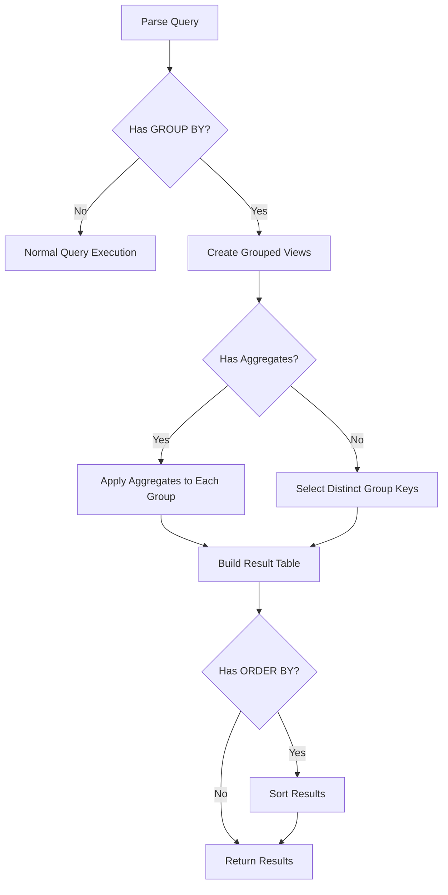

# GROUP BY Implementation Design

## Current State Analysis

### AST Representation
The parser already captures GROUP BY in the AST:
```rust
pub struct SelectStatement {
    pub group_by: Option<Vec<String>>,  // GROUP BY columns
    pub order_by: Option<Vec<OrderByColumn>>,
    // ... other fields
}
```

**Issue Found**: Parser currently parses ORDER BY before GROUP BY, but SQL standard requires:
```sql
SELECT ... FROM ... WHERE ... GROUP BY ... ORDER BY ... LIMIT ...
```

### Current Gaps
1. No GROUP BY execution in query_executor.rs or query_engine.rs
2. Parser order needs fixing (GROUP BY should be parsed before ORDER BY)
3. No aggregation support when GROUP BY is present

## Proposed DataView-Based Implementation

### Core Concept
Use DataView's ability to create filtered views as the foundation for GROUP BY:

```rust
impl DataView {
    /// Create a map of group keys to DataViews for each group
    pub fn group_by(&self, group_columns: &[String]) -> Result<HashMap<Vec<DataValue>, DataView>> {
        // 1. Get column indices for group columns
        // 2. Build unique combinations of group values
        // 3. For each unique combination, create a filtered DataView
        // 4. Return map of group_key -> DataView
    }
}
```

### Implementation Strategy

#### Phase 1: Basic GROUP BY Support
1. **Fix parser order** - GROUP BY before ORDER BY
2. **Implement DataView::group_by()** method
3. **Handle simple GROUP BY without aggregates**

#### Phase 2: Aggregate Functions with GROUP BY
1. **Detect aggregate functions** in SELECT when GROUP BY is present
2. **Apply aggregates** to each group's DataView
3. **Build result table** from aggregated values

#### Phase 3: Multi-level GROUP BY
For queries like `GROUP BY trader, book`:
```rust
// Recursive approach for multi-level grouping
pub fn group_by_recursive(&self, columns: &[String]) -> GroupedView {
    if columns.is_empty() {
        return GroupedView::Leaf(self.clone());
    }
    
    let first_col = &columns[0];
    let remaining = &columns[1..];
    
    let mut groups = HashMap::new();
    for unique_value in self.unique_values(first_col) {
        let filtered = self.filter_by_value(first_col, unique_value);
        groups.insert(
            unique_value,
            filtered.group_by_recursive(remaining)
        );
    }
    
    GroupedView::Node(groups)
}
```

### Execution Flow



## Implementation Details

### 1. DataView Group By Method

```rust
impl DataView {
    pub fn group_by(&self, group_columns: &[String]) -> Result<BTreeMap<GroupKey, DataView>> {
        let mut groups = BTreeMap::new();
        let source = self.source();
        
        // Get column indices
        let col_indices: Vec<usize> = group_columns
            .iter()
            .map(|col| source.get_column_index(col))
            .collect::<Option<Vec<_>>>()
            .ok_or_else(|| anyhow!("Invalid group by column"))?;
        
        // Iterate through visible rows
        for row_idx in self.get_filtered_rows() {
            // Build group key from row values
            let mut key = Vec::new();
            for &col_idx in &col_indices {
                key.push(source.get_value(row_idx, col_idx).clone());
            }
            
            // Add row to appropriate group
            groups.entry(GroupKey(key))
                .or_insert_with(|| DataView::new(source.clone()))
                .add_row_to_filter(row_idx);
        }
        
        Ok(groups)
    }
}
```

### 2. Query Executor Integration

```rust
// In query_executor.rs
pub fn execute_select(&mut self, stmt: &SelectStatement) -> Result<DataTable> {
    // ... existing WHERE clause handling ...
    
    if let Some(group_by_cols) = &stmt.group_by {
        // Create grouped views
        let groups = self.data_view.group_by(group_by_cols)?;
        
        // Check for aggregate functions
        let has_aggregates = stmt.select_items.iter().any(|item| {
            matches!(item, SelectItem::Expression { expr, .. } 
                if is_aggregate_function(expr))
        });
        
        if has_aggregates {
            // Process aggregates for each group
            return self.execute_grouped_aggregates(groups, stmt);
        } else {
            // Return distinct group keys
            return self.execute_grouped_select(groups, stmt);
        }
    }
    
    // ... existing non-grouped execution ...
}
```

### 3. Aggregate Processing

```rust
fn execute_grouped_aggregates(
    &self,
    groups: BTreeMap<GroupKey, DataView>,
    stmt: &SelectStatement
) -> Result<DataTable> {
    let mut result = DataTable::new("result");
    
    // Add columns for group keys and aggregates
    for col in &stmt.columns {
        result.add_column(col);
    }
    
    // Process each group
    for (group_key, group_view) in groups {
        let mut row = Vec::new();
        
        for item in &stmt.select_items {
            match item {
                SelectItem::Column(col) if stmt.group_by.contains(col) => {
                    // Add group key value
                    let idx = stmt.group_by.iter().position(|c| c == col).unwrap();
                    row.push(group_key.0[idx].clone());
                }
                SelectItem::Expression { expr, .. } => {
                    // Evaluate aggregate on group
                    let value = self.evaluate_aggregate(expr, &group_view)?;
                    row.push(value);
                }
                _ => return Err(anyhow!("Non-aggregate column in GROUP BY"))
            }
        }
        
        result.add_row(row)?;
    }
    
    Ok(result)
}
```

## Testing Strategy

### Test Cases

1. **Simple GROUP BY**
```sql
SELECT trader FROM trades GROUP BY trader
-- Should return unique traders
```

2. **GROUP BY with COUNT**
```sql
SELECT trader, COUNT(*) as total FROM trades GROUP BY trader
-- Should return trader with row count
```

3. **Multi-column GROUP BY**
```sql
SELECT trader, book, SUM(quantity) FROM trades GROUP BY trader, book
-- Should group by both columns
```

4. **GROUP BY with ORDER BY**
```sql
SELECT trader, SUM(quantity) as total 
FROM trades 
GROUP BY trader 
ORDER BY total DESC
-- Should sort after grouping
```

5. **GROUP BY with WHERE**
```sql
SELECT trader, COUNT(*) 
FROM trades 
WHERE price > 50 
GROUP BY trader
-- Should filter before grouping
```

## Performance Considerations

1. **Memory Usage**: Each group creates a new DataView (lightweight - just indices)
2. **Optimization**: Use BTreeMap for sorted group keys
3. **Lazy Evaluation**: Don't materialize groups until needed
4. **Index Reuse**: Share source DataTable across all group views

## Next Steps

1. ✅ Analyze current AST structure
2. 📝 Document implementation plan (this document)
3. 🔧 Fix parser to handle GROUP BY before ORDER BY
4. 🏗️ Implement DataView::group_by() method
5. 🔌 Integrate into query executor
6. 🧪 Add comprehensive tests
7. 📊 Handle aggregate functions with GROUP BY
8. 🎯 Optimize performance for large datasets